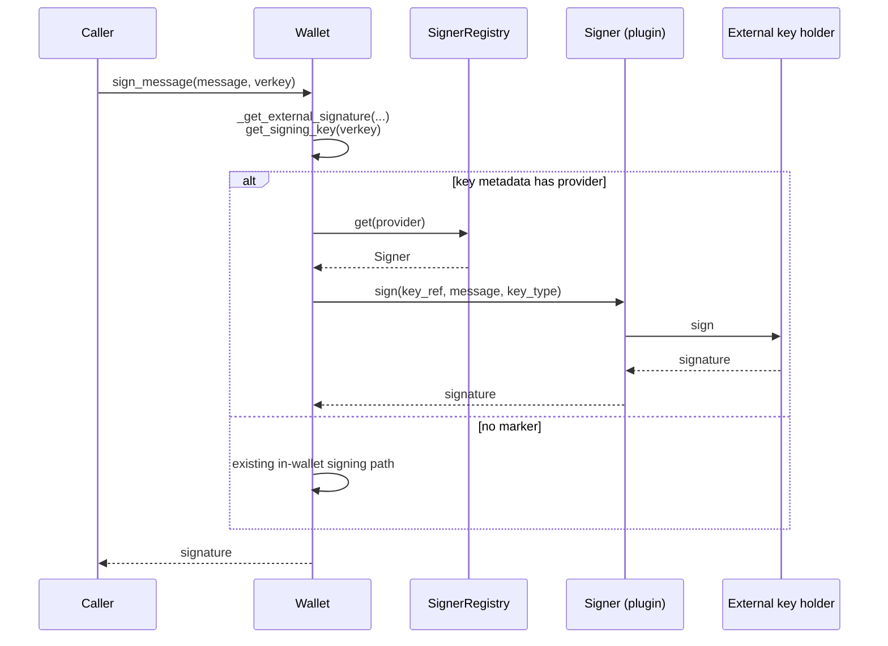

# External Signers

Some deployments need private keys that never enter the wallet — held in an HSM, a cloud KMS, or any other key holder. ACA-Py supports this through the `SignerRegistry`: a plugin registers a `Signer` under a provider name, keys are created through that provider with `POST /wallet/keys`, and the wallet's `sign_message` dispatches to the provider (via `BaseWallet._get_external_signature`) instead of signing in-wallet.

The agent stores only the public key and an opaque reference to the private key. Key lookup, multikey addressing, and software-key signing stay in the wallet.

> :warning: `AskarWallet` (`wallet.type: askar` or `askar-anoncreds`) and `KanonWallet` (`kanon-anoncreds`) are the only implementations supporting this dispatch today.

## The `Signer` protocol

A signer implements two methods:

```python
# acapy_agent/wallet/signer_registry.py
@runtime_checkable
class Signer(Protocol):
    async def sign(
        self, key_ref: str, message: Union[List[bytes], bytes], key_type: KeyType
    ) -> bytes: ...

    async def generate_keypair(self, key_ref: str, key_type: KeyType) -> str: ...
```

`key_ref` is an opaque identifier generated by ACA-Py when the key is created; the signer uses it to find the private key. `message` is passed through unchanged — a list only arises for multi-message schemes such as BBS+. Return the raw signature in the **same encoding the wallet would produce for `key_type`**, so that callers of `sign_message` see a uniform result whether the key is software- or externally-held.

`generate_keypair` creates a key pair identified by `key_ref` and returns its base58 verkey, in exactly the form `aries_askar.Key.get_public_bytes()` produces for that key type — for P-256, the 33-byte SEC1-compressed point. Raise `WalletError` for an unsupported key type.

## Registering a signer

ACA-Py does not bind a `SignerRegistry` by default — the first plugin that needs one binds it on the root context, and later plugins reuse it:

```python
async def setup(context: InjectionContext):
    registry = context.inject_or(SignerRegistry)
    if registry is None:
        registry = SignerRegistry()
        context.injector.bind_instance(SignerRegistry, registry)

    registry.register("luna-prod", MySigner(...))
```

`register` raises `ValueError` if the name is already taken. The name is the **provider name** and is persisted into key metadata, so pick a stable one — renaming it later means migrating every key that refers to it. A plugin can read the name from its configuration, so one deployment can run several backends of the same kind under different names.

## Creating a key with a provider

```http
POST /wallet/keys
{ "alg": "p256", "provider": "luna-prod", "kid": "optional-kid" }

201
{ "multikey": "zDnae...", "kid": "optional-kid" }
```

`MultikeyManager.create` (behind the route):

1. Rejects an unknown `alg`, a `kid` already bound to a key, a `seed` combined with `provider`, and an unregistered `provider`, before calling the signer.
2. Generates `key_ref` (a UUID) and calls the provider's `generate_keypair`. A `WalletError` from the provider is returned as a 400.
3. Stores the public key with `wallet.insert_public_key`, with the provider and `key_ref` in its metadata and the optional `kid` in the same insert.

The stored key record:

```json
{
  "name": "<base58 verkey>",
  "key": "<public key only>",
  "metadata": { "provider": "luna-prod", "key_ref": "6f1c2e0a-4b7d-4c1e-9a3f-2d8e5b7c9a10" },
  "tags": { "multikey": "zDnae...", "kid": ["optional-kid"] }
}
```

Requests never carry `key_ref`, and responses never return it. The provider is fixed when the key is created; changing custody means creating a new key.

The public-only key entry holds no private material. Fetching it and calling `key.sign_message(...)` directly will fail; always sign through `wallet.sign_message`.

## How dispatch works



`BaseWallet._get_external_signature(message, from_verkey, session)` is concrete and shared by all wallets. It returns:

| Situation | Result |
|---|---|
| Key lookup finds no record or otherwise fails | `None` — sign in-wallet |
| Key record has no `provider` metadata | `None` — sign in-wallet |
| `provider` names an unregistered provider | `WalletError` |
| `provider` set but `key_ref` missing | `WalletError` |
| Signer found | the signer's signature |

The two `WalletError` cases are deliberate: a key marked as provider-held has no private key to fall back on, so silently trying the in-wallet path would only produce a more confusing failure.

Binding a `kid` later (`PUT /wallet/keys`, or automatic binding during JWT and LD-proof signing) keeps the key's metadata, so a provider-held key stays usable.

`replace_signing_key_metadata` raises `WalletError` if the new metadata adds, drops, or changes `provider` or `key_ref`. To change other fields, pass the existing metadata back with your changes.

## Supporting external signers in a new wallet

`sign_message` remains abstract. A wallet opts in by consulting the helper before its own signing path:

```python
async def sign_message(self, message, from_verkey) -> bytes:
    if (
        sig := await self._get_external_signature(
            message, from_verkey, self.session
        )
    ) is not None:
        return sig
    # ... existing implementation unchanged ...
```

That is the entire change for signing. The helper resolves the registry through the provided profile session, so a wallet without one passes `None` and never dispatches externally.

To support creating keys with a provider, the wallet also implements `insert_public_key(verkey, key_type, metadata, kid)`. `BaseWallet`'s default raises `WalletError`.

## Why dispatch lives in core

A plugin cannot own this seam cleanly. To intercept signing from outside, it would have to wrap or monkey-patch `BaseWallet`, which puts it on the call path for *every* wallet operation rather than only the keys it holds — a much broader privilege than the feature needs, and a coupling to private internals that breaks on refactors. Two such plugins installed together would also collide. Keeping the check in `BaseWallet` leaves the wallet in charge of key records and software-key signing, and limits each plugin to the keys created through it.
